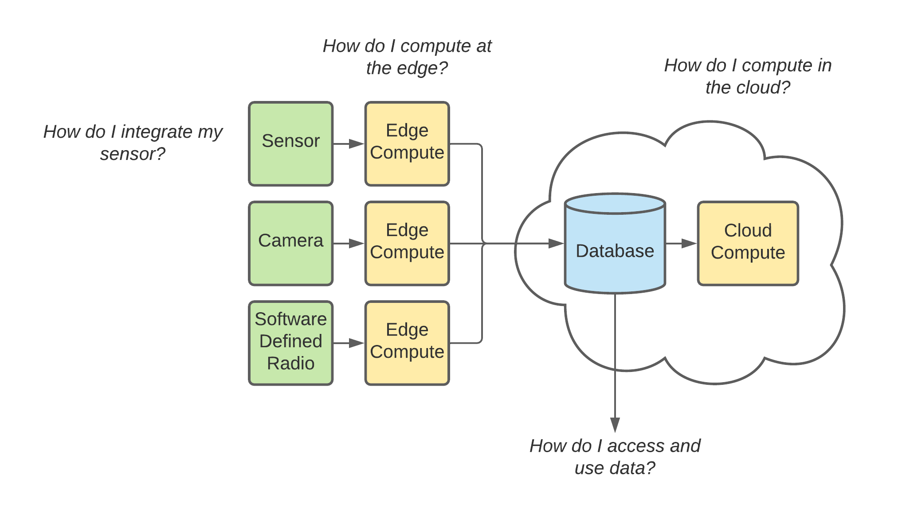

# Waggle: A distributed software-defined sensor network.

## What is Waggle?
The [Waggle AI@Edge](https://wa8.gl/) will design and build a new kind of national-scale reusable cyberinfrastructure to enable AI at the edge.

Geographically distributed sensor systems that include cameras, microphones, and weather and air quality stations can generate such large volumes of data that fast and efficient analysis is best performed by an embedded computer connected directly to the sensor. Waggle will explore new techniques for applying machine learning algorithms to data from such intelligent sensors and then build reusable software that can run programs within the embedded computer and transmit the results over the network to central computer servers. Distributed, intelligent sensor networks that can collect and analyze data are essential for scientists seeking to understand the impacts of global urbanization, natural disasters such as flooding and wildfires, and climate change on natural ecosystems and city infrastructure.

Waggle will deploy sensor nodes that support machine learning frameworks in environmental testbeds in California, Colorado, and Kansas and in urban environments in Illinois and Texas. The reusable cyberinfrastructure running on these testbeds will give climate, traffic, and ecosystem scientists new data for building models to study these coupled systems. The software components developed in Waggle will be open source and provide an open architecture that will enable scientists from a wide range of fields to build their own intelligent sensor networks.

Partners will deploy Waggle testbeds in Australia, Japan, UK, and Taiwan, providing scientists with even more data for analysis. The toolkit will also extend the current educational curriculum used in Chicago and will inspire young people – with an emphasis on women and minorities, to pursue science, technology, and mathematics careers – by providing a platform for students to explore measurement-based science questions related to the natural and built environments.

Waggle will develop open source computer code and provide open hardware design documents.  The data from sensors will also be hosted in the cloud to facilitate easy data analysis.

Supporting documentation for the software and hardware that define the Waggle AI@Edge platform can be found on the [Waggle GitHub site](https://github.com/waggle-sensor/waggle).

## Who are the users of Waggle?

While anyone can be a student of Waggle the most frequent users will be:

- Domain scientist interested in developing edge AI applications.
- Users interested in Waggle datasets.
- Cyber-infrastructure researchers interested in platform research.
- Domain scientist interest in adding new sensors and deploying Waggle nodes to answer specific science questions.

## How do I use Waggle?

With a basic understanding of what the [Waggle AI@Edge](https://wa8.gl/) is, the next question is how does Waggle work and how can I use Waggle? This depends on your desired interaction interest.

Waggle, in it's simplest form, consists of edge compute applications which process data (ex. sensor readings, camera images, audio recordings, etc). These edge applications then produce their own data (ex. inferences) and upload the results to a cloud database. This cloud database can be accessed directly and/or additional compute can be performed on the cloud data.

The entry-point into learning about your interaction with Waggle can be best directed by getting answers (by following the links) to the question(s) you are most interested in.

[How do I access sensors?](../tutorials/access-waggle-sensors.md)
- Want to learn about the sensors that Waggle already supports?
- Do you have a new sensor that you want to write an edge application for?

[How do I run edge apps?](../tutorials/edge-apps/intro-to-edge-apps)
- Want to know how to create an edge app?
- Want to know how your edge app can get access to edge sensor data?
- Want to share my edge app data with other edge applictions?
- Want to know how to upload data to the cloud?

[How do I access and use data?](../tutorials/accessing-data.md)
- Want to learn about how Waggle data is stored/organized?
- Do you have data that is up in the cloud and want to know how to access it?

[How do I compute in the cloud?](../tutorials/cloud-compute.md)
- Want to know how to autonmously react to edge produced data?
- Want to know how to trigger an HPC event?
- Want to get a text message when your edge application does something cool?

[How do I build my own Waggle device?](../tutorials/create-waggle.md)
- Want to set up your own device to build up an edge app on it?
- Want to teach AI to a classroom of students with an instruction manual?

## How is the Waggle cyber-infrastructure architected?

If you are interested in learning more about how the Waggle Cyber-infrastructure works you can head on over to the [Waggle Architecture Overview](./architecture.md) page.
