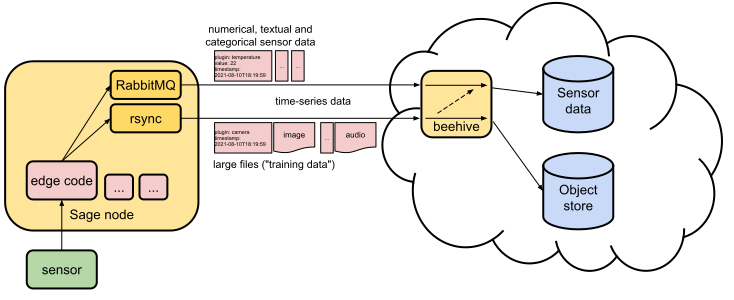

# Access and use data




Raw sensor data is collected by edge code. This edge code can either talk to sensor hardware directly or may obtain data from an abstraction layer (not show in image above). Edge code may forward unprocessed sensor data, do light processing to convert raw sensor values into final data products, or may use CPU/GPU-intensive workloads (e.g. AI application) to extract information from data-intensive sensors such as cameras, microphone or LIDAR.  

Sensor data from nodes that comes in numerical or textual form (e.g. temperature) is stored natively in our time series database. Sensor data in form of large files (images, audio, movies..) is stored in the Sage object store, but is referenced in the time series data (thus the dashed arrow in the figure above). Thus, the primary way to find all data (sensor and large files) is via the Sage sensor query API described below.

Currently the Sage sensor database contains data such as:

- relative humidity, barometric pressure, ambient temperature and gas (VOC) [BME680](https://www.bosch-sensortec.com/products/environmental-sensors/gas-sensors/bme680/)
- rainfall measurements [(Hydreon RG-15)](https://sage-commons.sdsc.edu/dataset/rg-15) 
- AI-based cloud coverage estimation from camera images
- AI-based object counts from camera images
- (system data of the nodes, free disk space etc.)

Data can be accessed via "data bundles"  or the query API.

## Restricted access files

While almost all Sage data is open, some types of data requires a written Data Use Agreement for access.  This includes raw image and audio data taken from certain locations. Please [contact us](mailto:support@sagecontinuum.org) if you are interested in access. The sensor log (see Query API) contains references to both restricted and unrestricted files. Downloading restricted files without authorization will return a `401 Unauthorized`.

## Data Bundles

**Data Bundles** provide sensor data and associated metadata in a single, large, downloadable file.  Soon, each Data Bundle available for download will have a DOI that can be used for publication citations.

Data Bundles are compiled nightly and may be downloaded in [this archive](https://web.lcrc.anl.gov/public/waggle/sagedata/SAGE-Data.tar).

## Data API

The Sage **data API** provides immediate and flexible access to sensor data via search over time and metadata tags. It is primarily intended to support exploratory and near real time use cases.

Due to the wide variety of possible queries, we do not attempt to provide DOIs for results from the data API. Instead, we leave it up to users to organize and curate datasets for their own applications. Long term, curated data is instead provided via **Data Bundles**.

### Using the Data API

There are two recommended approaches to working with the Data API:

1. Use the [Python Sage Data Client](https://pypi.org/project/sage-data-client/).
2. Use the HTTP API.

Each is appropriate for different use cases and integrations, but generally the following rule applies:

_If you just want to get data into a Pandas dataframe for analysis and plotting, use the sage-data-client, otherwise use the HTTP API._

#### Sage Data Client

The Sage Data Client is a Python library which streamlines querying the data API and getting the results into a Pandas dataframe. For details on installation and usage, please see the [Python package](https://pypi.org/project/sage-data-client/).

#### HTTP API

This example shows how to retrieve data the latest data from a specific sensor (you can adjust the `start` field if you do not get any recent data):

```console
curl -H 'Content-Type: application/json' https://data.sagecontinuum.org/api/v1/query -d '
{
    "start": "-10s",
    "filter": {
        "sensor": "bme680"
    }
}
'

```
Example results:
```json
{"timestamp":"2021-08-09T19:26:03.880781217Z","name":"iio.in_humidityrelative_input","value":70.905,"meta":{"node":"000048b02d15bdcd","plugin":"plugin-metsense:0.1.1","sensor":"bme680"}}
{"timestamp":"2021-08-09T19:26:03.878659392Z","name":"iio.in_pressure_input","value":975.78,"meta":{"node":"000048b02d15bdcd","plugin":"plugin-metsense:0.1.1","sensor":"bme680"}}
{"timestamp":"2021-08-09T19:26:03.872652127Z","name":"iio.in_resistance_input","value":93952,"meta":{"node":"000048b02d15bdcd","plugin":"plugin-metsense:0.1.1","sensor":"bme680"}}
{"timestamp":"2021-08-09T19:26:03.874998057Z","name":"iio.in_temp_input","value":27330,"meta":{"node":"000048b02d15bdcd","plugin":"plugin-metsense:0.1.1","sensor":"bme680"}}
```

:::tip
More details on how to use the query API can be found [here](https://github.com/waggle-sensor/waggle-beehive-v2/blob/main/docs/querying-measurements.md#query-api)
:::

## Data model

A detailed description of the data model can be found [here](https://github.com/waggle-sensor/waggle-beehive-v2/blob/main/docs/querying-measurements.md#data-model).

## Accessing large files (i.e. training data)
SAGE collects large files for AI training purposes. These files stored in an S3 bucket hosted by the [Open Storage Network](https://www.openstoragenetwork.org/).

To find these files use the filter `"name":"upload"` and specify additional filters to limit search results, for example:

```console
curl -s -H 'Content-Type: application/json' https://data.sagecontinuum.org/api/v1/query -d '{
  "start": "2021-09-10T12:51:36.246454082Z",
  "end":"2021-09-10T13:51:36.246454082Z",
  "filter": {
    "name":"upload",
    "plugin":"imagesampler-left:0.2.3"
    }
  }'
```

Output:
```json
{"timestamp":"2021-09-10T13:19:27.237651354Z","name":"upload","value":"https://storage.sagecontinuum.org/api/v1/data/sage/sage-imagesampler-left-0.2.3/000048b02d05a0a4/1631279967237651354-2021-09-10T13:19:26+0000.jpg","meta":{"job":"sage","node":"000048b02d05a0a4","plugin":"imagesampler-left:0.2.3","task":"imagesampler-left:0.2.3"}}
{"timestamp":"2021-09-10T13:50:32.29028603Z","name":"upload","value":"https://storage.sagecontinuum.org/api/v1/data/sage/sage-imagesampler-left-0.2.3/000048b02d15bc3d/1631281832290286030-2021-09-10T13:50:32+0000.jpg","meta":{"job":"sage","node":"000048b02d15bc3d","plugin":"imagesampler-left:0.2.3","task":"imagesampler-left:0.2.3"}}
{"timestamp":"2021-09-10T12:52:59.782262376Z","name":"upload","value":"https://storage.sagecontinuum.org/api/v1/data/sage/sage-imagesampler-left-0.2.3/000048b02d15bdc2/1631278379782262376-2021-09-10T12:52:59+0000.jpg","meta":{"job":"sage","node":"000048b02d15bdc2","plugin":"imagesampler-left:0.2.3","task":"imagesampler-left:0.2.3"}}
{"timestamp":"2021-09-10T13:49:49.084350086Z","name":"upload","value":"https://storage.sagecontinuum.org/api/v1/data/sage/sage-imagesampler-left-0.2.3/000048b02d15bdd2/1631281789084350086-2021-09-10T13:49:48+0000.jpg","meta":{"job":"sage","node":"000048b02d15bdd2","plugin":"imagesampler-left:0.2.3","task":"imagesampler-left:0.2.3"}}
```


For a quick way to only extract the urls from the json objects above, a tool like [jq](https://stedolan.github.io/jq/) can be used:

```console
curl -s -H 'Content-Type: application/json' https://data.sagecontinuum.org/api/v1/query -d '{
  "start": "2021-09-10T12:51:36.246454082Z",
  "end":"2021-09-10T13:51:36.246454082Z",
  "filter": {
    "name":"upload",
    "plugin":"imagesampler-left:0.2.3"
    }
  }' | jq -r .value > urls.txt
```

The resulting file `urls.txt` will look like this:
```text
https://storage.sagecontinuum.org/api/v1/data/sage/sage-imagesampler-left-0.2.3/000048b02d05a0a4/1631279967237651354-2021-09-10T13:19:26+0000.jpg
https://storage.sagecontinuum.org/api/v1/data/sage/sage-imagesampler-left-0.2.3/000048b02d15bc3d/1631281832290286030-2021-09-10T13:50:32+0000.jpg
https://storage.sagecontinuum.org/api/v1/data/sage/sage-imagesampler-left-0.2.3/000048b02d15bdc2/1631278379782262376-2021-09-10T12:52:59+0000.jpg
https://storage.sagecontinuum.org/api/v1/data/sage/sage-imagesampler-left-0.2.3/000048b02d15bdd2/1631281789084350086-2021-09-10T13:49:48+0000.jpg
```

To download the files:
```console
wget -i urls.txt
```

If many files are downloaded, it is better to preserve the directory tree structure to prevent filename collision:
```console
wget -r -i urls.txt
```

For access to restricted files see Section [Restricted access files](#restricted-access-files). Username and password can be specified via  `--user=<user> --password=<password>` when using `wget`, or `-u <user>:<password>` when using curl.


