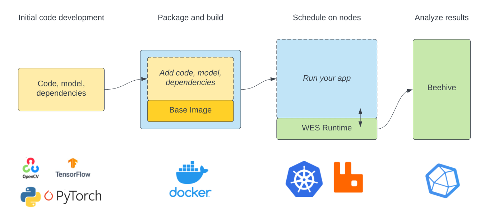

# Compute at the Edge

## Introduction to edge applications

The nodes run edge applications (i.e. __plugins__) to process data. A plugin is a self-contained program which typically reads sensors, audio or video data, does some processing and then publishes information derived from that data.

The most basic example of a plugin is one which reads and publishes a value from a sensor. A more complex plugin could publish the number of birds in a scene using a deep learning model.

Plugins are composed of code, models and dependencies which are then packaged as container images that can be scheduled on nodes.

Finally, the plugin development workflow follows the three primarly states illustrated below:

First, **data and model selection** is where you scope the problem and identify a new or existing model for your application. This typically happens _outside_ of our ecosystem.

Second, **develop and test** is where you begin to integrate your initial code with our ecosystem, test and finally build your application in ECR.

Finally, **deploy and iterate** is where you schedule your application for deployment and look at the results.

## Exploring existing edge applications

One of the major goals of Waggle is to provide the science community with a diverse set of edge applications to enable new kinds of research. These edge applications are maintained in the [Edge Code Repository](https://portal.sagecontinuum.org) where you can find more background information and links to their source repos.

We encourage users to explore the [ECR](https://portal.sagecontinuum.org) to get familiar with existing applications as well a references if you develop your own edge applications.

## Developing new edge applications

Writing a new edge applications (i.e. __plugin__) consists of the following steps:

1. Write plugin code
2. (Optional) Test and debug plugin code with Waggle nodes
3. Submit plugin to the [Edge Code Repository](https://portal.sagecontinuum.org)
4. Schedule plugin for deployment
5. Access plugin data

The following sections cover each of these steps in detail.

### Write plugin code

The entry point to writing plugins is our Python library [pywaggle](https://github.com/waggle-sensor/pywaggle). This library provides all the necessary abstractions for accessing and publishing data. For this step, please refer to pywaggle's own in-depth guide on [writing plugins](https://github.com/waggle-sensor/pywaggle/blob/main/docs/writing-a-plugin.md).

### Test and debug plugin code in Waggle nodes

If you have Waggle nodes set up for your plugin development (Consult with us for this resource), plugin code can be tested against the nodes to make sure it works, and the plugin does not crash when it is deployed to nodes in the field. We provide a set of tools to support access for Waggle node resource and the ability to debug/test plugin code. Detailed examples and instructions can be found [here](https://github.com/sagecontinuum/ses/tree/master/docs/pluginctl/README.md).

### Submit plugin to the Edge Code Repository

We require plugins to be submitted to the [Edge Code Repository](https://portal.sagecontinuum.org) to be built and tested to validate that they are ready to be scheduled on nodes.

The following steps are required to submit a plugin to ECR.

1. Create a repo for plugin and add required packaging files. (See [pywaggle guide](https://github.com/waggle-sensor/pywaggle/blob/main/docs/writing-a-plugin.md#adding-hello-world-plugin-packaging-info) for details.)
2. Go to [Edge Code Repository](https://portal.sagecontinuum.org).
3. Go to "Sign In" and follow the instructions.
4. Go to "My Apps".
5. Go to "Create app" and follow the instructions.

If everything is successful, your plugin will appeared and be marked as "Built".

### Schedule plugin for deployment

_TODO This is work in progress! We will update this section once the scheduler is public._

### Access plugin data

Once a plugin has been deployed to node(s) and is publishing data, you can [access the published data](./accessing-data.md) in the Data Repository.
