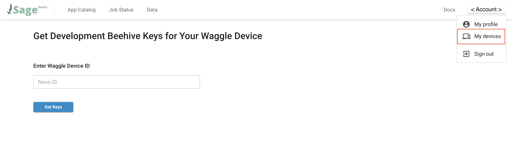

# Building your own Waggle device

Are you a professor that wants to use affordable Waggle devices to teach students interested in AI? Are you someone interested in developing a new [edge app](./edge-apps/1-intro-to-edge-apps.md) using a local development platform? Are you a Waggle user interested in using a new sensor (i.e. a new camera, a bat signal detector, a custom sensor they built)? If you would like to build, design and deploy software that could answer your questions above, then Waggle is the right choice for you.

This tutorial will guide you in preparing your own Waggle device and (optionally) registering it to upload data to a shared [development Beehive](../about/architecture.md#beehive). This Waggle device is a fully unlocked development platform running the same [WES infrastructure](../about/architecture.md#waggle-edge-stack-wes) that runs in production Waggle edge devices (ex. the [Wild Waggle Node](../about/architecture.md#wild-waggle-node)). This is an ideal platform for users interested in developing a new [edge app](./edge-apps/1-intro-to-edge-apps.md) and/or experimenting with a [new sensor](./access-waggle-sensors.md#bring-your-own-sensor-to-waggle).

## Getting Started

To get started in boot-strapping your Waggle Edge Computing kit you can follow the instructions for the various supported platforms on the [node-platforms](https://github.com/waggle-sensor/node-platforms) GitHub page.

> We currently support a limited set of hardware platform because making edge devices into Waggle requires some hardware specific instructions. Check out [the platforms](https://github.com/waggle-sensor/node-platforms#supported-platforms) we support as of now. More platforms will be added in the future. However, if you would like to add support for other platforms go ahead and submit a [pull request](https://docs.github.com/en/pull-requests/collaborating-with-pull-requests/proposing-changes-to-your-work-with-pull-requests/creating-a-pull-request) to [node-platforms](https://github.com/waggle-sensor/node-platforms).

### Registering your Waggle device

During the bootstrapping process you will have the option to register your device within the web portal [here](https://portal.sagecontinuum.org/account/dev-devices). It is highly recommended to register your device, as this enables all the core [WES tools](../about/architecture.md#waggle-edge-stack-wes) to be automatically downloaded, enabling the edge app development and run-time environment. Additionally, this enables your edge apps to publish data to the development [Beehive](../about/architecture.md#beehive), accessible to cloud-based analysis tools and workflow frameworks.

To register your device, use the [dev devices form](https://portal.sagecontinuum.org/account/dev-devices). Enter your device ID (which you will obtain through the hardware boot-strapping process) then click "Get Keys" button. A "registration zip" file will be generated and available for download. Then follow the instructions for [your device](https://github.com/waggle-sensor/node-platforms) to load the registration keys.

<!---

-->

> You may register as many times as you want. But note that each registration key has a short expiration time and should be used shortly after generation.

Now you are ready to develop your edge apps and/or introduce new sensors to the Waggle platform. Head over to the [overview](../about/overview.md) to find the instructions you need for development.
