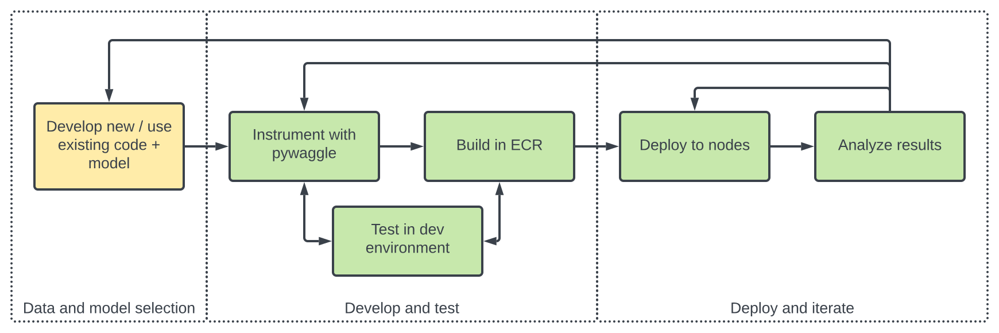

# Part 2: Creating an edge app

In [part 1](intro-to-edge-apps), we showed an overview of what edge apps are and how they fit into the Waggle ecosystem. Now, we'll dive right in and start writing our very own edge app!

## Prerequisites

We'll assume the reader has some experience in [Python](https://www.python.org) for development and [git](https://git-scm.com) for version control.

## Development workflow

In the next few parts of this tutorial, we'll deep dive into the following app development workflow:



First, **data and model selection** is where you scope the problem and identify a new or existing model for your application. This typically happens _outside_ of our ecosystem.

Second, **develop and test** is where you begin to integrate your initial code with our ecosystem, test and finally build your application in [ECR](/docs/about/architecture#edge-code-repository-ecr).

Finally, **deploy and iterate** is where you schedule your application for deployment and look at the results.

## Preparing an example for the edge

In order to illustrate progress through each of these stages, we'll start with a concrete code example and iterate on it over the next few sections.

In practice, _lots_ of work goes into the data and model selection step. For now, we'll assume that groundwork has already been done and we've settled on the following code snippit to start with.

```python
import numpy as np
import cv2


def compute_mean_color(image):
    return np.mean(image, (0, 1)).astype(float)


def main():
    # read example image from file
    image = cv2.imread("example.jpg")

    # compute mean color
    mean_color = compute_mean_color(image)

    # print mean color
    print(mean_color)


if __name__ == "__main__":
    main()
```

In order to follow along, create an empty `main.py` file and copy and paste the code snippits as we progress through the tutorial.

This code above is a great start but needs a few improvements before it's ready for the edge. We'll work through these over the next few sections.

### Installing pywaggle

The first step in preparing our example for the edge is to install [pywaggle](https://github.com/waggle-sensor/pywaggle) in your local development environment.

pywaggle is our Python SDK which provides edge apps access to devices (ex. cameras and microphones) and messaging within a node.


For this tutorial, we'll install the latest version of pywaggle with all optional dependencies in our local development environment using:

```sh
pip3 install 'pywaggle[all]'
```

### Accessing a camera

Now that we have pywaggle, the first change we'll make is to use a camera as input rather than a static image file.

```python
import numpy as np

from waggle.data.vision import Camera


def compute_mean_color(image):
    return np.mean(image, (0, 1)).astype(float)


def main():
    # open camera and take snapshot
    with Camera() as camera:
        snapshot = camera.snapshot()

    # compute mean color
    mean_color = compute_mean_color(snapshot.data)

    # print mean color
    print(mean_color)


if __name__ == "__main__":
    main()
```

Now, we can try this out by running:

```sh
python3 main.py
```

You should see output like:

```txt
[51.43575738 51.83611871 54.64226671]
```

_You're exact numbers may differ as this is computed using your default camera._

### Publishing results

The next change we'll make is to publish our data to the [Beehive Data Repository](/docs/about/architecture#data-repository-dr) instead of just print it. This will allow it to be sent to a Beehive once it's scheduled on a node.

```python
import numpy as np

from waggle.plugin import Plugin
from waggle.data.vision import Camera


def compute_mean_color(image):
    return np.mean(image, (0, 1)).astype(float)


def main():
    with Plugin() as plugin:
        # open camera and take snapshot
        with Camera() as camera:
            snapshot = camera.snapshot()

        # compute mean color
        mean_color = compute_mean_color(snapshot.data)

        # publish mean color
        plugin.publish("color.mean.r", mean_color[0], timestamp=snapshot.timestamp)
        plugin.publish("color.mean.g", mean_color[1], timestamp=snapshot.timestamp)
        plugin.publish("color.mean.b", mean_color[2], timestamp=snapshot.timestamp)


if __name__ == "__main__":
    main()
```

Now, we'll run this using:

```sh
python3 main.py
```

You may notice something... there's no output! Usually, published data is sent to a beehive where it can be viewed later. However, because we're developing locally and have not configured a beehive, the data isn't going anywhere. In the next section, we'll see how we can tap into our published data.

### Viewing run logs

In order to make developing and debugging apps easier, pywaggle can write out a log directory as follows:

```sh
export PYWAGGLE_LOG_DIR=test-run
python3 main.py
```

This will create a new directory named `test-run` and will contain a file named `data.ndjson` which contains something like:

```json
{"name":"color.mean.r","ts":1659649285404613000,"meta":{},"val":41.216171875}
{"name":"color.mean.g","ts":1659649285404613000,"meta":{},"val":40.8623828125}
{"name":"color.mean.b","ts":1659649285404613000,"meta":{},"val":42.65227322048611}
```

If we run `python3 main.py` again, then we'll see new data appended to that file:

```json
{"name":"color.mean.r","ts":1659649285404613000,"meta":{},"val":41.216171875}
{"name":"color.mean.g","ts":1659649285404613000,"meta":{},"val":40.8623828125}
{"name":"color.mean.b","ts":1659649285404613000,"meta":{},"val":42.65227322048611}
{"name":"color.mean.r","ts":1659649380989242000,"meta":{},"val":42.72360460069444}
{"name":"color.mean.g","ts":1659649380989242000,"meta":{},"val":42.572535807291665}
{"name":"color.mean.b","ts":1659649380989242000,"meta":{},"val":44.36891818576389}
```

This provides a convenient way to understand the behavior of an app, particularly one with a more complicated flow.

### Uploading a sample

Finally, the last change we'll make is to upload our snapshots after publishing the mean color.

We'll upload every snapshot for demonstration purposes, but you wouldn't want to do this in a real app. Instead, you'd typically upload in response to detecting an event such as an anomalous object or loud noise.

```python
import numpy as np

from waggle.plugin import Plugin
from waggle.data.vision import Camera


def compute_mean_color(image):
    return np.mean(image, (0, 1)).astype(float)


def main():
    with Plugin() as plugin:
        # open camera and take snapshot
        with Camera() as camera:
            snapshot = camera.snapshot()

        # compute mean color
        mean_color = compute_mean_color(snapshot.data)

        # publish mean color
        plugin.publish("color.mean.r", mean_color[0], timestamp=snapshot.timestamp)
        plugin.publish("color.mean.g", mean_color[1], timestamp=snapshot.timestamp)
        plugin.publish("color.mean.b", mean_color[2], timestamp=snapshot.timestamp)

        # save and upload image
        snapshot.save("snapshot.jpg")
        plugin.upload_file("snapshot.jpg", timestamp=snapshot.timestamp)


if __name__ == "__main__":
    main()
```

Let's run our app again using:

```sh
export PYWAGGLE_LOG_DIR=test-run
python3 main.py
```

If you take a look in the `test-run/uploads` directory, you should now see an image.

Uploads are added to the run log directory using the format `nstimestamp-filename`.

You should also see a corresponding item in the `data.ndjson` file.

```json
{"name":"color.mean.r","ts":1659650274683007000,"meta":{},"val":46.39777994791667}
{"name":"color.mean.g","ts":1659650274683007000,"meta":{},"val":46.66985785590278}
{"name":"color.mean.b","ts":1659650274683007000,"meta":{},"val":48.90661024305555}
{"name":"upload","ts":1659650274683007000,"meta":{"filename":"snapshot.jpg"},"val":"/Users/sean/git/instrument-with-pywaggle-example/run-log/uploads/1659650274683007000-snapshot.jpg"}
```

## Next steps

Congratulations! You've finished preparing our example code for the edge!

In the [part 3](testing-an-edge-app), we'll look at how we can build and test our app on a real node!
